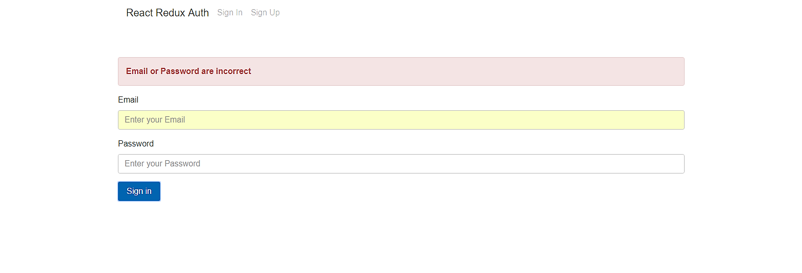

# Client side authentication react redux

## React Redux Project


```
> git clone https://github.com/jwill9999/client-side-authentication-react-redux
> cd client-side-authentication-react-redux
> npm install
> npm run start
> open in browser localhost:8080
```




# API Endpoints

> all requests to the server are made to ROOT_URL localhost:3000/ 

> /signin

> /signup


# JWT Auth Token 

> The server on signup or signin will send a JWT token

> this is stored in localstorage

> sent to server in headers as key: "authorization" value: "jwt_web_token"


# Client side validation and Error warnings

> Form Data is validated on the client and you will not be able to submit data to the server unless all requirements are fulfilled.

> local error message displayed to client.

> server side request errors also displayed where appropriate to the client via bootstrap alert box which cycles off after 5 seconds.

> a validation module is available for you to add to src/Services/validation


## Info

> This React Redux code has been designed to work alongside [https://github.com/jwill9999/Node_Auth_API_with_JWT_Boilerplate](https://github.com/jwill9999/Node_Auth_API_with_JWT_Boilerplate)

> The above server is built with all the appropriate end points and works with a mongodb database. See its README.md file for full details.
